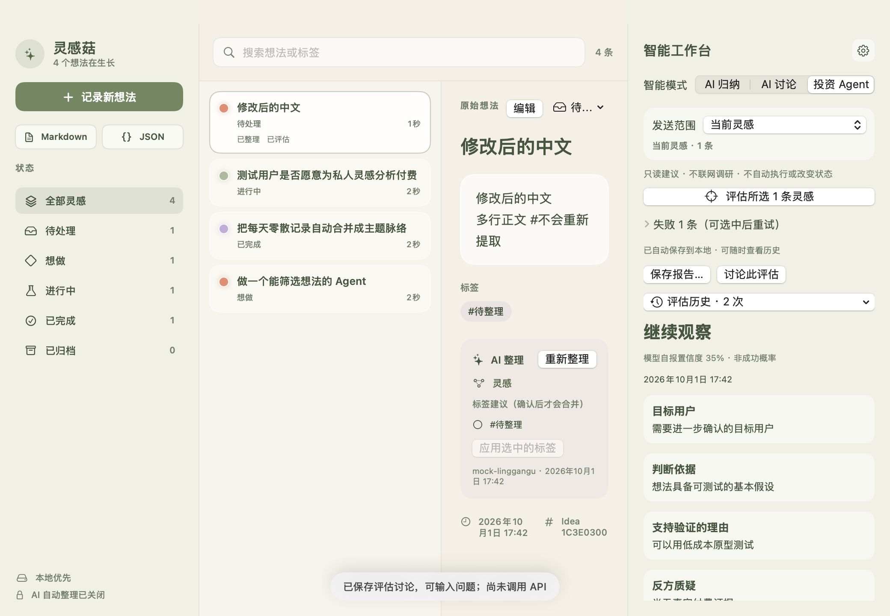

# 灵感菇 · IdeaShroom

[English](README.en.md)

macOS 桌面灵感记录工具：物理气泡收纳想法，支持 AI 整理、对话与投资视角评估。本地存储，自备 API Key。

> 0.2.3 Beta · macOS 14+ · Apple Silicon（M 系列）  
> 未使用 Developer ID 签名，未经过 Apple 公证。当前采用本地 ad-hoc 签名。  
> 源码可用（ELv2），不是 OSI 开源许可。不支持 Windows；Intel Mac 未验收。

<p align="center">
  
</p>

外形示意：玻璃蘑菇。实际桌面组件背景透明，灵感以可拖动的物理气泡呈现。



## 下载和安装

发布后，从本仓库 **Releases** 下载 `LingGanGu-0.2.3-beta-macos-arm64.zip` 和同名 `.sha256` 文件。源码 ZIP 不是可运行应用。

1. 校验下载文件：在文件所在目录运行 `shasum -a 256 -c LingGanGu-0.2.3-beta-macos-arm64.zip.sha256`。
2. 解压，将「灵感菇.app」拖入「应用程序」，再打开。
3. 若系统提示无法验证开发者，先核实来源与校验值，再按 [Apple 官方说明](https://support.apple.com/102445) 在「系统设置 → 隐私与安全」选择“仍要打开”。
4. 不要关闭 Gatekeeper、SIP 或全局安全检查；如果系统提示恶意软件或文件损坏，停止操作并反馈。
5. 菜单栏蘑菇图标可打开工作台、AI 设置或退出。关闭窗口不等于退出应用。

详细步骤、升级与数据恢复见 [安装指南](docs/INSTALLATION.md)。

## 能做什么

- `⌘⇧Space` 快速记录；没有网络或 API Key 也能保存。
- 透明悬浮蘑菇，气泡有重力、碰撞和拖动交互；点击查看对应灵感。
- 本地搜索、编辑、标签、归档、Markdown/JSON 导出。
- 五个状态：待处理、想做、进行中、已完成、已归档；全部灵感包含归档。
- 手动标签优先；创建时未填写标签才提取正文中的 #标签。
- AI 整理、指定范围归纳、流式对话及永久本地历史。
- 投资视角评估：正反理由、缺失证据、最小实验、报告导出与继续讨论。
- “已整理／已评估”独立标记；AI 不自动改变行动状态或执行外部任务。

## API 与隐私

打开菜单栏「AI 设置」，填写服务商的 Base URL、准确模型 ID 和自己的 Key，保存后测试连接。支持 OpenAI-compatible Chat Completions，不保证所有厂商协议或模型兼容。包括 DeepSeek 在内的配置说明见 [配置指南](docs/AI_CONFIGURATION_GUIDE.md)。

Key 只保存于用户本机钥匙串；应用从用户电脑直接请求其配置的 API 服务商，不经过开发者服务器。没有账号后台、云同步、共享密钥池或遥测上传。不同电脑/系统账户各自保存；共用同一 macOS 登录账户会共用配置。

API 使用独立临时会话，禁用缓存/Cookie，拒绝重定向。请求只发送所选范围及必要的会话/评估上下文；自动整理默认关闭，真实请求可能收费。服务商仍会收到所发送内容和用于认证的 Key。不要把密钥写在灵感正文中，它会作为普通内容保存和导出。

临时签名版更新后，实际 AI 调用可能再次要求钥匙串授权；不要为消除提示授权所有应用读取密钥。

## Beta 限制

- 无 Developer ID 签名/公证，无自动更新；仅 Apple Silicon 发布包。
- 本地 SQLite 未另加应用级数据库加密；请保护系统账户并使用合适的磁盘保护。
- JSON 可导出全部历史，但尚无一键导入；备份恢复需按安装指南操作。
- 保存回复失败时请先“重新保存回复”；尚无独立崩溃恢复日志。
- 投资 Agent 不联网调查，置信度不是成功概率，输出仅供验证参考。
- 完整 Xcode/XCTest 与 GitHub CI 的实际运行状态以 Actions 为准；本地 CLI 检查不等于 XCTest。
- 尚未完成所有 macOS 版本、不同系统账户、VoiceOver 和多显示器组合的人工验收。

## 从源码构建

需要 Mac、Swift 6+ 工具链；完整 Xcode 用于 XCTest。运行：

```bash
swift build
swift run LingGanGuCoreChecks
swift run LingGanGu --ui-smoke
python3 Scripts/check-api-redirects.py "$(swift build --show-bin-path)/LingGanGuCoreChecks"
swift test
```

UI smoke 需要图形登录会话，使用临时数据库和 Mock，不访问真实 Keychain/API。重定向测试仅使用回环地址和假密钥。

生成 Apple Silicon Release 测试包：

```bash
bash Scripts/build-beta.sh
```

产物在 `dist/`。该命令明确生成 ad-hoc 未公证 Beta，不会自动上传。本地开发安装可用 `bash Scripts/package-local-app.sh`。后续有证书时可配置 `LINGGANGU_SIGNING_IDENTITY`，公证仍是独立步骤。

## 反馈和许可

Bug 和功能建议请提交 Issue；v1 前不接受外部 PR 或代码补丁。不要公开密钥、数据库或私人灵感。安全问题见 [SECURITY.md](SECURITY.md)。

Copyright © 2026 Huo_miao。源码遵循 [Elastic License 2.0](LICENSE)；托管限制以许可证原文为准，见 [商业使用说明](COMMERCIAL_USE.md)。依赖和图像来源见 [第三方声明](THIRD_PARTY_NOTICES.md)，品牌政策见 [TRADEMARKS.md](TRADEMARKS.md)。

[公开进度](PLANS.md) · [更新日志](CHANGELOG.md) · [投资 Agent 指南](docs/INVESTMENT_AGENT.md) · [发布说明](docs/RELEASE_NOTES.md)
